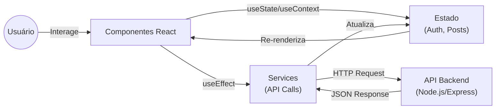
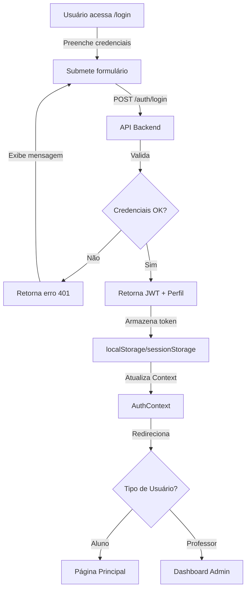

# 📚 Diário de Classe - Frontend

Aplicação web responsiva construída com **React**, **Vite**, **TypeScript** e **styled-components** para a plataforma de blogging voltada à educação pública. Interface moderna e intuitiva para professores e alunos.


## 📋 Contexto

Esta é a camada de apresentação (Frontend) do projeto **Diário de Classe**, desenvolvida como parte do Tech Challenge 03 do curso de Full Stack Development da FIAP (Turma 7FSDT).

O frontend consome a API REST desenvolvida em Node.js/Express e oferece uma experiência de usuário completa para:
- **Alunos**: Leitura de posts, autenticação e visualização de conteúdo
- **Professores**: Criação, edição e exclusão de postagens com área administrativa protegida

---

## ⚙️ Funcionalidades

### Páginas e Funcionalidades Principais

#### 📖 **Página Principal (Public)**
- Lista dinâmica de posts com busca por palavras-chave
- Cards responsivos com preview de conteúdo
- Filtro por disciplinas (Português, Matemática, Biologia, etc.)
- Paginação inteligente

#### 📝 **Página de Leitura (Public)**
- Conteúdo completo do post
- Informações do autor (professor)
- Data de publicação e disciplina
- Seção de comentários (opcional/local)
- Navegação entre posts

#### 🔐 **Área de Autenticação**
- Login para Professores e Alunos
- Cadastro de novos usuários
- Validação de credenciais via API
- Armazenamento seguro de JWT em localStorage/sessionStorage
- Recuperação de perfil autenticado

#### 👨‍🏫 **Área Administrativa (Professores)**
- Dashboard com lista de posts do professor
- Criar novo post com validação em tempo real
- Editar posts existentes
- Deletar posts com confirmação
- Acesso restrito apenas a professores autenticados

#### 👤 **Perfil de Usuário**
- Exibição de informações do perfil
- Logout seguro
- Redirecionamento baseado em roles

---

## 🏗️ Arquitetura

### Estrutura do Projeto

```
frontend/
├── src/
│   ├── components/          # Componentes React reutilizáveis
│   │   ├── PostCard.tsx
│   │   ├── PostForm.tsx
│   │   ├── LoginForm.tsx
│   │   ├── Header.tsx
│   │   ├── Footer.tsx
│   │   └── ...
│   ├── pages/               # Páginas completas
│   │   ├── Home.tsx
│   │   ├── PostDetail.tsx
│   │   ├── Login.tsx
│   │   ├── AdminDashboard.tsx
│   │   └── ...
│   ├── services/            # Lógica de chamadas à API
│   │   └── api.ts           # Cliente HTTP (axios/fetch)
│   ├── context/             # Context API para estado global
│   │   └── AuthContext.tsx
│   ├── hooks/               # Custom React Hooks
│   │   ├── useAuth.ts
│   │   └── usePost.ts
│   ├── styles/              # Estilos globais e temas
│   │   ├── GlobalStyle.ts
│   │   └── theme.ts
│   ├── types/               # Tipos TypeScript
│   │   └── index.ts
│   ├── utils/               # Funções utilitárias
│   │   ├── validators.ts
│   │   └── helpers.ts
│   ├── App.tsx              # Componente raiz
│   ├── main.tsx             # Ponto de entrada
│   └── vite-env.d.ts
├── public/                  # Arquivos estáticos
├── package.json
├── vite.config.ts
├── tsconfig.json
├── .env.example
└── README.md
```

### Fluxo de Dados



### Principais Bibliotecas

- **React 18+**: Framework UI
- **TypeScript**: Tipagem estática
- **Vite**: Build tool e dev server
- **React Router v6**: Roteamento entre páginas
- **styled-components**: CSS-in-JS com suporte a temas
- **axios** ou **fetch**: Cliente HTTP
- **Context API**: Gerenciamento de estado global (autenticação)
- **React Hook Form** (opcional): Gerenciamento de formulários
- **SWR** ou **React Query** (opcional): Caching e sincronização de dados

---

## 🚀 Instalação e Execução

### Pré-requisitos

- [Node.js](https://nodejs.org/) (versão 18.x ou superior)
- [npm](https://www.npmjs.com/) ou [yarn](https://yarnpkg.com/)
- API Backend rodando (veja [DiarioDeClasse](https://github.com/FIAPGrupo20/DiarioDeClasse))

### Setup Local

1. **Clone o repositório:**
   ```bash
   git clone https://github.com/FIAPGrupo20/DiarioDeClasseFront.git
   cd DiarioDeClasseFront
   ```

2. **Instale as dependências:**
   ```bash
   npm install
   ```

3. **Configure as variáveis de ambiente:**
   
   Crie um arquivo `.env` na raiz do projeto:
   ```env
   VITE_API_URL=http://localhost:3000
   VITE_APP_NAME=Diário de Classe
   ```
   
   _Use `.env.example` como referência._

4. **Inicie o servidor de desenvolvimento:**
   ```bash
   npm run dev
   ```
   
   A aplicação estará disponível em `http://localhost:5173` (Vite padrão).

### Build para Produção

```bash
npm run build
```

Isso gera uma pasta `dist/` com os arquivos otimizados para produção.

### Preview de Produção Localmente

```bash
npm run preview
```

---

## 🧪 Testes

### Testes Unitários e de Integração (Vitest + React Testing Library)

Execute a suite de testes:

```bash
npm run test
```

Modo watch (re-executa ao salvar):

```bash
npm run test:watch
```

Relatório de cobertura:

```bash
npm run test:coverage
```

### Testes Manuais

1. **Testar fluxo de login:**
   - Acesse a página de login
   - Insira credenciais válidas
   - Verifique se o token é armazenado e o usuário é redirecionado

2. **Testar busca de posts:**
   - Na página principal, use o campo de busca
   - Verifique os resultados filtrados

3. **Testar criação de post (Professor):**
   - Faça login como professor
   - Acesse o dashboard administrativo
   - Crie um novo post e verifique se aparece na lista

4. **Testar responsividade:**
   - Abra o DevTools (F12)
   - Teste em diferentes resoluções (mobile, tablet, desktop)

---

## 🔐 Autenticação e Autorização

### Fluxo de Login



### Proteção de Rotas

As rotas administrativas (criação, edição, deletagem de posts) requerem autenticação via JWT. O token é enviado automaticamente em todas as requisições via header `Authorization: Bearer <token>`.

---

## 🎨 Customização de Temas

O projeto usa **styled-components** com suporte a temas dinâmicos. Customize o arquivo `src/styles/theme.ts`:

```typescript
export const lightTheme = {
  colors: {
    primary: "#007bff",
    secondary: "#6c757d",
    success: "#28a745",
    danger: "#dc3545",
    background: "#ffffff",
    text: "#333333",
  },
  fonts: {
    main: "'Segoe UI', Tahoma, Geneva, Verdana, sans-serif",
  },
};
```

---

## 📡 Integração com API

### Variáveis de Ambiente

```env
# URL base da API Backend
VITE_API_URL=http://localhost:3000

# Nome da aplicação
VITE_APP_NAME=Diário de Classe

# Modo de debug (opcional)
VITE_DEBUG=false
```

### Exemplo de Chamada à API

```typescript
// src/services/api.ts
import axios from 'axios';

const api = axios.create({
  baseURL: import.meta.env.VITE_API_URL,
});

// Interceptor para adicionar token JWT
api.interceptors.request.use((config) => {
  const token = localStorage.getItem('authToken');
  if (token) {
    config.headers.Authorization = `Bearer ${token}`;
  }
  return config;
});

export const authService = {
  login: (email: string, password: string) =>
    api.post('/auth/login', { email, password }),
  getProfile: () =>
    api.get('/auth/me'),
};

export const postsService = {
  getAllPosts: () =>
    api.get('/posts'),
  getPostById: (id: string) =>
    api.get(`/posts/${id}`),
  createPost: (data: PostData) =>
    api.post('/posts', data),
  updatePost: (id: string, data: PostData) =>
    api.put(`/posts/${id}`, data),
  deletePost: (id: string) =>
    api.delete(`/posts/${id}`),
  searchPosts: (query: string) =>
    api.get(`/posts/search?q=${query}`),
};
```

---

## 🔄 CI/CD e Deploy

### Opção 1: Vercel (Recomendado)

1. Faça push do código para GitHub
2. Conecte o repositório no [Vercel](https://vercel.com)
3. Configure as variáveis de ambiente
4. Deploy automático a cada push para `main`

### Opção 2: GitHub Pages

```bash
npm run build
npm run deploy
```

### Opção 3: Docker

Crie um `Dockerfile` na raiz do frontend:

```dockerfile
# Build stage
FROM node:24-alpine AS builder
WORKDIR /app
COPY package*.json ./
RUN npm install
COPY . .
RUN npm run build

# Production stage
FROM nginx:alpine
COPY --from=builder /app/dist /usr/share/nginx/html
EXPOSE 80
CMD ["nginx", "-g", "daemon off;"]
```

Build e execute:

```bash
docker build -t diario-classe-frontend .
docker run -p 80:80 diario-classe-frontend
```

---

## 📚 Recursos Úteis

- [React Documentation](https://react.dev)
- [Vite Guide](https://vitejs.dev/guide/)
- [TypeScript Handbook](https://www.typescriptlang.org/docs/)
- [styled-components Docs](https://styled-components.com/docs)
- [API Backend - Swagger](http://localhost:3000/api-docs)

---

## 📜 Licença

Este projeto está licenciado sob a **Licença MIT**.

---

## 👥 Composição do Grupo

Grupo 05:

- Ana Caroline Gonzaga Acquesta
- Bruno de Camargo Guimarães
- Luiz Alfredo Bernardo
- Roberta Alves de Oliveira

---

## 🤝 Contribuindo

Para contribuir com o projeto:

1. Faça um fork do repositório
2. Crie uma branch para sua feature (`git checkout -b feature/nova-feature`)
3. Commit suas mudanças (`git commit -m 'Adiciona nova feature'`)
4. Push para a branch (`git push origin feature/nova-feature`)
5. Abra um Pull Request

---

**Desenvolvido com ❤️ para educação pública**
